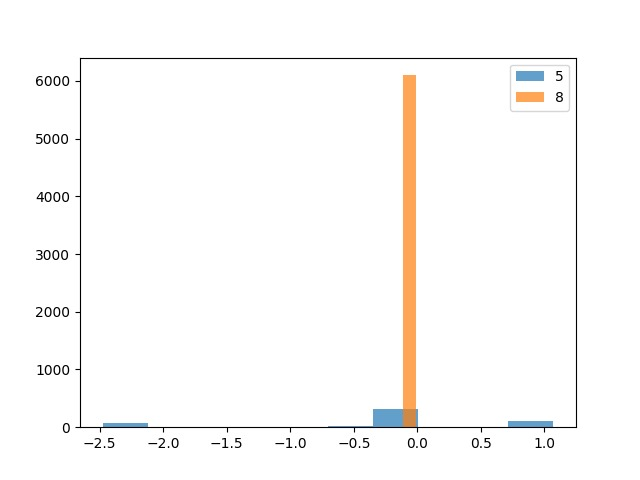
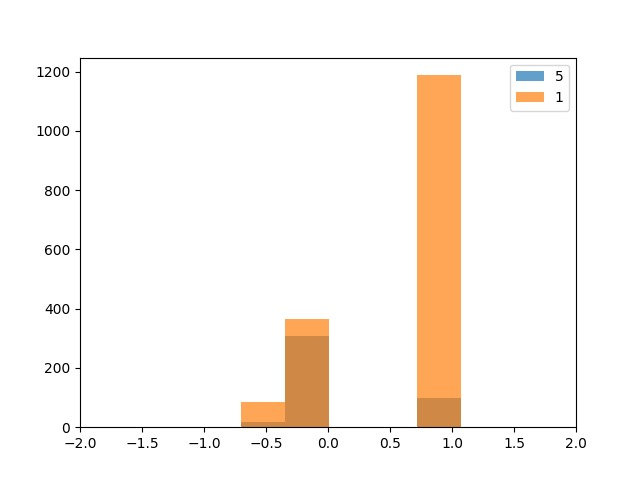
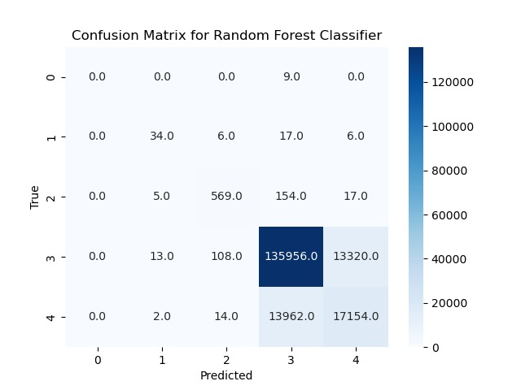
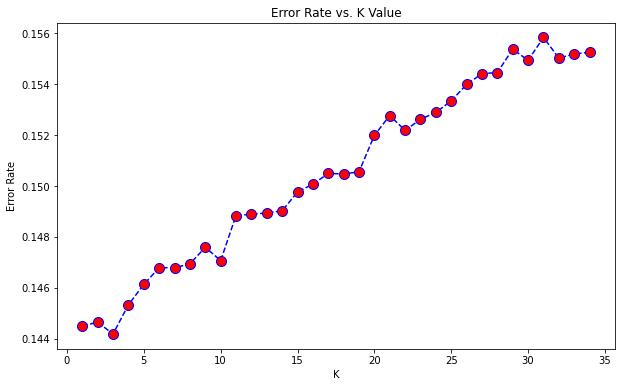

# AppsAnalysis
A data analysis project for mobile applications and its uses based on the CRISP-DM methodology.
This project includes:
<ul>
<li><strong>Backend</strong> - built with Node.js and MongoDB to store and manipulate the datasets.</li>
<li><strong>Analysis</strong> - Full Exploratory Data Analysis (EDA).</li>
<li><strong>Modeling</strong> - Data mining models evaluation.</li>
</ul>

## Business understanding:
What is the probability of an application in the google playstore to achieve success considering different varients?

## Data understanding:
Selecting relevant data from various datasources containing data of the apps in the google playstore.

ADD MORE DESCRIPTION ABOUT THE DATA: tables and features

## Data preparation:
Using star scheme design in order to decide which data to explore.

ADD SCEHMA

## Modeling:

### (1) Supervised learning in order to predict the success rate of an app based on price:
  <u>Continuous variable:</u>

  1. Random forest regressor
  2. Linear rgression

### (2) Supervised learning in order to predict the success rate of an app based on rating:
  <u>Discreet variable:</u>

  3. Random forest classifier
  4. KNeighborsClassifier
  5. SVM classifier 

### (3) unsupervised learning algorithms in order to predict the success rate of an app

## Evaluation and Conclusions:

### (1)

### (2)

### (3)

